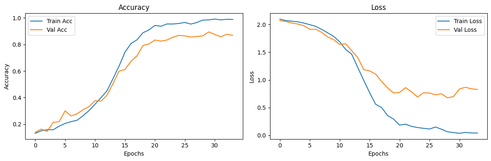

# 🎙️ Speech Emotion Recognition (SER)

This project focuses on **detecting human emotions from speech** using deep learning.  
It uses a hybrid **CNN + LSTM** architecture that learns emotional cues like tone, pitch, and intensity from audio signals to classify speech into emotional states.

---

## 🧠 Overview

This repository implements a **hybrid CNN + LSTM model** for **Speech Emotion Recognition (SER)** on the [RAVDESS Emotional Speech Audio Dataset](https://www.kaggle.com/datasets/uwrfkaggler/ravdess-emotional-speech-audio).  
It extracts acoustic features such as **MFCC**, **Chroma**, and **Mel Spectrograms** to capture both spectral and temporal information from speech.

---

## 🏗️ Model Architecture

The SER model is composed of:

1. **Feature Extraction**
   - Mel-Frequency Cepstral Coefficients (MFCCs)
   - Chroma Features
   - Mel Spectrograms

2. **Deep Learning Pipeline**
   - **CNN Layers** → Capture spatial patterns from spectrograms  
   - **LSTM Layers** → Learn temporal dependencies  
   - **Dense Layers** → Classify emotions from learned features  

3. **Output Classes (8 Emotions):**
   - Neutral  
   - Calm  
   - Happy  
   - Sad  
   - Angry  
   - Fearful  
   - Disgust  
   - Surprised  

---

## 📊 Results

| Metric | Score |
| --- | --- |
| **Training Accuracy** | 98.3% |
| **Validation Accuracy** | 86.5% |
| **Best Validation Loss** | 0.6761 |
| **Best Epoch (Early Stopping)** | 29 / 100 |

**Insight:**  
The CNN captures emotional nuances in spectrograms, while the LSTM models the time-series emotion flow, resulting in robust emotion classification.

---

## 🖼️ Visualizations

Training and validation metrics:

<p align="center">
  
</p>

---

## 🚀 How to Run

### 🧩 Step 1️⃣ — Clone the Repository
```bash
git clone https://github.com/sarthakkhurana815/Speech-Emotion-Recognition.git
cd Speech-Emotion-Recognition
```


### 🧩 Step 2️⃣ — Create and Activate Environment
```bash
python -m venv venv
source venv/bin/activate  # Mac/Linux
.\venv\Scripts\activate   # Windows
```


### 🧩 Step 3️⃣ — Install Dependencies
```bash
pip install -r requirements.txt
```

### 🧩 Step 4️⃣ — Run the Notebook
```bash
Open SER.ipynb in Jupyter Notebook or VS Code and execute all cells to:

Preprocess the dataset

Extract audio features

Train and evaluate the CNN+LSTM model
```

### 🧩 Tech Stack
```bash
| Category             | Tools               |
| -------------------- | ------------------- |
| **Language**         | Python              |
| **Deep Learning**    | TensorFlow, Keras   |
| **Audio Processing** | Librosa             |
| **Data Handling**    | NumPy, Pandas       |
| **Visualization**    | Matplotlib, Seaborn |
| **Dataset**          | RAVDESS             |
```

### 📁 Project Structure
```bash
Speech-Emotion-Recognition/
│
├── SER.ipynb                  # Main Jupyter notebook
├── requirements.txt           # Dependencies
├── README.md                  # Documentation
├── data/                      # Audio dataset (RAVDESS)
├── features/                  # Extracted MFCCs and spectrograms
└── models/                    # Saved model weights
```

### 🌱 Future Improvements

🌟 Improvement 1️⃣ — Integrate Attention Mechanisms
Enhance temporal feature learning and improve emotion context tracking.

🌟 Improvement 2️⃣ — Use Transformer Architectures
Experiment with Wav2Vec 2.0 or HuBERT for end-to-end speech feature representation.

🌟 Improvement 3️⃣ — Build a Streamlit Web App
Create a real-time speech emotion detection interface for demo purposes.

